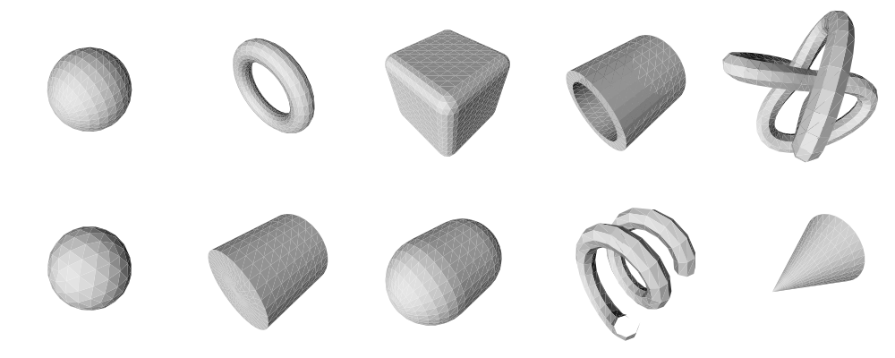

# Generator - A procedural geometry generation library.

The purpose of this library is to easily generate procedural meshes of geometric
primitives such as spheres, boxes, cones, cylinders etc.

Generator is not a graphics library. It will only produce data for any graphics
library to use.

## Compiling ##

To compile you will need a c++11 compatible compiler (tested with gcc 4.8) and
cmake (tested with cmake 2.8).

Generator needs a vector math library to work. It will use GML.
Get it from: https://github.com/ilmola/gml.git
There are no other dependencies.

Compile with:
~~~
cmake .
make
~~~

If GML is not in the include path, you can give it's path with: -DGML_INCLUDE_DIR
command line argument.

~~~
cmake . -DGML_INCLUDE_DIR=path/to/gml
make
~~~

The library "libgenerator" will be in the "lib" directory.

In "images" directory there is a program called "generate" that can generate svg
example/test images.

You can generate documentation with Doxygen. Run "generate" in the "images"
directory before doxygen as the documentation uses images generated by it.

## Usage ##

Make sure that that Generator and the GML math library are in the include path.

To include all primitives use:
~~~
#include <generator/generator.hpp>
~~~

To include individual primitives include a header file that has the same name as
the primitive class.
~~~
#include <generator/SphereMesh.hpp>
#include <generator/HelixPath.hpp>
#include <generator/CircleShape.hpp>
~~~

Everything in the library is under the namespace "generator".
The examples in this document will omit this namespace.

You will also need to link with libgenerator.

## Coordinate systems ##

Generator uses a right handed coordinate system (same as OpenGL).

All angles are in radians positive direction being counterclockwise when looking
towards the axis.

Vertices in triangles are in counterclockwise order.

All calculations are done double precision.

## Concepts ##

There are two main concepts in the library: "primitives" and "generators".

Primitives produce generators. Generators generate values such as vertex
coordinates.

## Primitives ##

There are three types of primitives: "shapes", "paths" and "meshes". All
primitive class names end with their type e.g. "SphereMesh", "HelixPath" or
"CircleShape".

### Shapes ###

Shapes are a set of ShapeVertices on the 2d xy-plane and a set of Edges
connecting them.
~~~
class ShapeVertex {
public:
	gml::dvec2 position;
	gml::dvec2 tangent;
	gml::dvec2 normal() const noexcept;
	double texCoord;
};
~~~
~~~
class Edge {
public:
	gml::uvec2 vertices;
};
~~~

All shapes have methods:
~~~
EdgeGenerator edges() const noexcept;
VertexGenerator vertices() const noexcept;
~~~

Where "EdgeGenerator" and "VertexGenerator" can be a arbitrary types. The shape
must outlive the generators it produces. If the shape is mutated the generators
are invalidated.

Available shapes are:

- CircleShape
- LineShape
- ParametricShape
- RectangleShape
- RoundedRectangleShape

### Paths ###

Paths are a set of PathVertices in 3d space and a set of edges connecting them.

~~~
class PathVertex {
public:
	gml::dvec3 position;
	gml::dvec3 tangent;
	gml::dvec3 normal;
	gml::dvec3 binormal() const noexcept;
	double texCoord;
};
~~~

All paths have methods:
~~~
EdgeGenerator edges() const noexcept;
VertexGenerator vertices() const noexcept;
~~~

"EdgeGenerator" and "VertexGenerator" are arbitrary types.

Available path are:

- HelixPath
- KnotPath
- LinePath
- ParametricPath

### Meshes ###

Meshes are a set of MeshVertices in 3d space and a set of Triangles connecting
them.

~~~
class MeshVertex {
public:
	gml::dvec3 position;
	gml::dvec3 normal;
	gml::dvec2 texCoord;
};
~~~
~~~
class Triangle {
public:
	gml::uvec3 vertices;
};
~~~

All meshes have methods:
~~~
TriangleGenerator triangles() const noexcept;
VertexGenerator vertices() const noexcept;
~~~

Again TriangleGenerator and VertexGenerator can be any types.

Available meshes are:

- BoxMesh
- CappedConeMesh
- CappedCylinderMesh
- CappedTubeMesh
- CapsuleMesh
- ConeMesh
- CylinderMesh
- DiskMesh
- PlaneMesh
- IcosahedronMesh
- IcoSphereMesh
- ParametricMesh
- RoundedBoxMesh
- SphereMesh
- SphericalConeMesh
- SphericalTriangleMesh
- SpringMesh
- TorusMesh
- TorusKnotMesh
- TriangleMesh
- TubeMesh

## Generators ##

Excluding any cached values the primitives don't store their data (vertices etc).
Instead the data is generated on the fly by using generators.

Generators are made by calling "edges()", "triangles()" or "vertices()" on the
primitive. Generators are lightweight objects analogous to iterators. They
typicly only contain pointer back to the Primitive and state info for iteration.
Any number of generators for the same primitive can exist at the same time.

Generators can have arbitrary types. Use the keyword "auto" to avoid the need
to type this type.

~~~
SphereMesh sphere{};
auto vertices = sphere.vertices();
~~~

If "auto" can not be used helper class templates "EdgeGeneratorType",
"TriangleGeneratorType" and "VertexGeneratorType" are provided in "util.hpp".

~~~
typename VertexGeneratorType<SphereMesh>::Type vertices = sphere.vertices();
~~~

If the generator type is known only at runtime, type erasing class template
"AnyGenerator" can be used (in "AnyGenerator.hpp").

~~~
AnyGenerator<MeshVertex> vertices = sphere.vertices();
~~~

There are also AnyShape, AnyPath and AnyMesh for storing shapes, path and meshes.

All generators have the following methods:
~~~
bool done() const noexcept;
Value generate() const;
void next();
void reset() noexcept;
~~~

Where "Value" can be "Edge", "Triangle", "ShapeVertex", "PathVertex" or
"MeshVertex".

These methods can be used to iterate over all values in the generators.

~~~
SphereMesh sphere{};
auto vertices = sphere.vertices();
while (!vertices.done()) {
	MeshVertex vertex = vertices.generate();
	// Do something with vertex
	vertices.next();
}
~~~

Once "done" returns true, calling "next" or "generate" will result
"std::out_of_bounds" exception being thrown. The generator can be rewound by
calling "reset".

## Iterators ##

It is possible to use an iterator to drive a generator. Use free functions
"begin" and "end" on the generator to get the iterators. If the generator is
deleted the iterators are invalid.

~~~
SphereMesh sphere{};
auto vertices = sphere.vertices();
std::for_each(begin(vertices), end(vertices), [] (const MeshVertex& vertex) {
	// do something with vertex
});
~~~

For loops will also work.
~~~
SphereMesh sphere{};
for (const MeshVertex& vertex : sphere.vertices()) {
	// do something with vertex
}
~~~

NOTE:
The function "begin" will first call "reset()" on the generator before returning
the iterator.

## Modifiers ##

Some primitives such as "TranslateMesh" do not generate data of their own.
Instead they modify data generated by another primitives. They are called
"modifiers".

Modifiers store the primitive they modify.

~~~
TranslateMesh<SphereMesh> translatedSphere{SphereMesh{}, {1.0f, 0.0f, 0.0f}};
for (const auto& vertex : translatedSphere.vertices()) { }
~~~

Multiple modifiers can be nested.

Each modifier also has a function to make one. The function form has the same
name as the class but starts with a lower case letter. "translateMesh" instead
of "TranslateMesh" etc. This makes template argument deduction possible.

~~~
auto result = translateMesh(
	rotateMesh(
		scaleMesh(TorusMesh{}, {0.5f, 1.0f, 1.0}),
		gml::radians(90.0), Axis::Y
	),
	{1.0f, 0.0f, 0.0f}
);
for (const MeshVertex& vertex : result.vertices()) { }
~~~

Available modifiers for shapes are:

- AxisSwapShape
- FlipShape
- MergeShape
- RotateShape
- ScaleShape
- SubdivideShape
- TransformShape
- TranslateShape

Available modifiers for paths are:

- AxisSwapPath
- FlipPath
- MergePath
- RotatePath
- ScalePath
- SubdividePath
- TransformPath
- TranslatePath

Available modifiers for meshes are:

- AxisSwapMesh
- ExtrudeMesh
- FlipMesh
- LatheMesh
- MergeMesh
- RotateMesh
- ScaleMesh
- SpherifyMesh
- SubdivideMesh
- TransformMesh
- TranslateMesh
- UvSwapMesh

## Preview and debug ##

For preview and debug purposes generator has class "SvgWriter" that can create
svg -images of primitives.

It also has class "ObjWriter" that can write obj -files of meshes that can be
viewed with most 3d programs such as Blender.
http://www.blender.org
